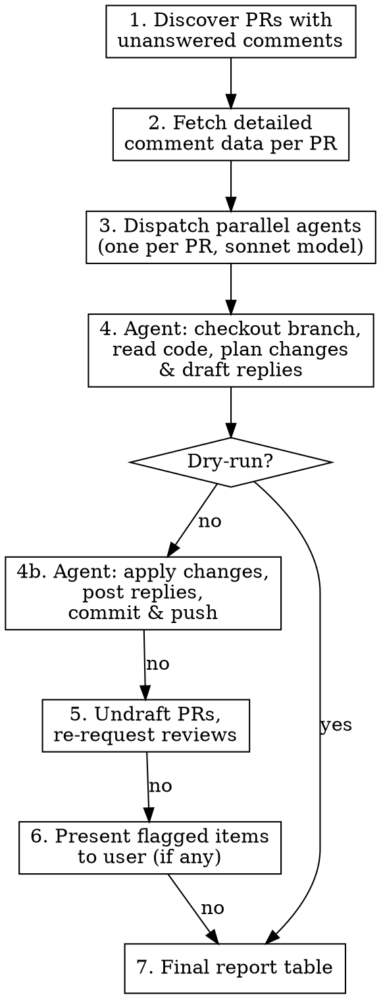

# Address PR Review Comments

Autonomously addresses unanswered review comments on pull requests. By default
operates on the current branch's PR. With `all`, discovers every open PR authored
by the current user across your GitHub org's repos. For each PR, addresses every comment
(code changes or discussion replies), pushes changes, undrafts if needed,
re-requests reviews, and produces a final report.

## Invocation

```text
/address-pr-comments                # Current PR only (detected from branch)
/address-pr-comments dry-run        # Current PR, dry-run mode
/address-pr-comments all            # All open PRs with unanswered comments
/address-pr-comments all dry-run    # All open PRs, dry-run mode
```

**Default behavior** (no `all`): detect the current PR from the active git branch and
process only that PR. If the branch has no associated PR, report it and stop.

**`all` mode**: discover all open PRs authored by the current user across your
GitHub org's repos and process every one that has unanswered review comments.

### Modes

| Mode | Discovery | Code Analysis | Code Changes | GitHub Replies | Push | Undraft | Re-request Reviews | Worktrees |
| --- | --- | --- | --- | --- | --- | --- | --- | --- |
| **Full** (default) | Yes | Yes | Yes | Yes | Yes | Yes | Yes | Cleaned up |
| **Dry-run** | Yes | Yes | Yes (in worktree) | No | No | No | No | Preserved |

**Dry-run mode** runs the full analysis pipeline — agents check out branches, read
code, and actually write the code changes into persistent worktrees under
`.worktrees/` — but nothing is posted to GitHub, committed, or pushed. You can
`cd` into each worktree and run `git diff` to inspect every change before
running in full mode.

### Argument Parsing

Tokenize the arguments:

- If any token (case-insensitive) matches `dry-run`, `dryrun`, or `dry_run`,
  set `{DRY_RUN}` to `true` and remove the token. Otherwise `{DRY_RUN}` is `false`.
- If any token (case-insensitive) matches `all`, set `{ALL_PRS}` to `true` and
  remove the token. Otherwise `{ALL_PRS}` is `false`.

## Workflow Overview



## Step 1: Discover PRs with Unanswered Comments

### 1a. Get GitHub Username

```bash
GH_USER=$(gh api user -q '.login')
```

### 1b. Determine Target PR(s)

**If `{ALL_PRS}` is `false`** (default): detect the current PR from the active branch.

```bash
CURRENT_BRANCH=$(git rev-parse --abbrev-ref HEAD 2>/dev/null || echo "")
CURRENT_REPO=$(gh repo view --json nameWithOwner -q '.nameWithOwner' 2>/dev/null || echo "")
```

Then look up the PR for the current branch. Note: `reviewThreads` is not
available via `gh pr view --json`, so use two calls:

```bash
# Get basic PR info
PR_DATA=$(gh pr view --json number,title,url,isDraft,headRefName,reviewRequests,reviews \
  -R "$CURRENT_REPO")
```

If no PR exists for the current branch, report it and stop:

```text
No open PR found for branch '{CURRENT_BRANCH}' in {CURRENT_REPO}.
Use `/address-pr-comments all` to process all open PRs.
```

Then fetch `reviewThreads` for that PR via GraphQL (the `--json` flag doesn't
support this field):

```bash
PR_NUMBER=$(echo "$PR_DATA" | python3 -c "import json,sys; print(json.load(sys.stdin)['number'])")
OWNER=$(echo "$CURRENT_REPO" | cut -d/ -f1)
REPO_NAME=$(echo "$CURRENT_REPO" | cut -d/ -f2)

gh api graphql -f query='
query($owner: String!, $repo: String!, $number: Int!) {
  repository(owner: $owner, name: $repo) {
    pullRequest(number: $number) {
      reviewThreads(first: 100) {
        nodes {
          isResolved
          path
          line
          startLine
          diffSide
          comments(first: 20) {
            nodes {
              databaseId
              body
              author { login }
              createdAt
            }
          }
        }
      }
    }
  }
}' -f owner="$OWNER" -f repo="$REPO_NAME" -F number="$PR_NUMBER"
```

Merge the `reviewThreads` data into `PR_DATA` before passing to Step 1d.

Filter the single PR's threads using the same logic as Step 1d below. If the
PR has no unanswered threads, report it and stop:

```text
PR #{NUMBER} has no unanswered review comments. Nothing to do.
```

Skip to Step 2 with the single-PR list.

**If `{ALL_PRS}` is `true`**: run the full GraphQL discovery query below.

### 1c. GraphQL Discovery Query (all mode)

Run this GraphQL query to find all open PRs with unresolved review threads
where the last comment is NOT from the PR author:

```bash
gh api graphql -f query='
query($searchQuery: String!) {
  search(query: $searchQuery, type: ISSUE, first: 50) {
    nodes {
      ... on PullRequest {
        number
        title
        url
        isDraft
        headRefName
        repository { nameWithOwner }
        reviewRequests(first: 20) {
          nodes {
            requestedReviewer {
              ... on User { login }
              ... on Team { name slug }
            }
          }
        }
        reviews(first: 50) {
          nodes {
            author { login }
            state
          }
        }
        reviewThreads(first: 100) {
          nodes {
            isResolved
            path
            line
            startLine
            diffSide
            comments(first: 20) {
              nodes {
                databaseId
                body
                author { login }
                createdAt
              }
            }
          }
        }
      }
    }
  }
}' -f searchQuery="is:pr is:open author:${GH_USER} org:${GH_ORG}"
```

**IMPORTANT**: Do NOT use `$login` variable interpolation inside the GraphQL
query string. The `gh api graphql` command's `-f` flag passes variables, but
the GitHub search `query` field is a plain string, not a GraphQL variable.
Pass the full search string directly via `-f searchQuery="..."` instead.

### 1d. Filter for Unanswered Threads

Save the GraphQL output to a temp file and use Python to filter:

```python
# Filter logic: thread is "unanswered" when ALL of:
# 1. Thread is NOT resolved
# 2. Either:
#    a. The LAST comment is NOT from GH_USER (reviewer left feedback the author hasn't replied to), OR
#    b. The thread has exactly ONE comment AND that comment IS from GH_USER
#       (self-review note left during the author's own review pass — no one has responded)
#
# Case (b) matters because authors often leave single-comment self-review threads
# as reminders of things to address. These need replies just like reviewer comments.
```

Write a Python script that:

1. Reads the GraphQL JSON output
2. For each PR, filters threads where `isResolved == false` AND:
   - `last_comment.author.login != GH_USER` (unanswered reviewer feedback), OR
   - `len(comments) == 1 AND comments[0].author.login == GH_USER` (self-review thread)
3. Produces a structured JSON with:

```json
[
  {
    "repo": "my-org/my-repo",
    "number": 5621,
    "title": "INF-3376 - ...",
    "url": "https://github.com/...",
    "isDraft": false,
    "headRefName": "task.INF-3376.increase-timeout",
    "reviewers": ["reviewer1", "reviewer2"],
    "previous_reviewers": ["reviewer1", "reviewer3"],
    "unanswered_threads": [
      {
        "path": "deployments/foo/main.tf",
        "line": 42,
        "startLine": null,
        "diffSide": "RIGHT",
        "reply_to_comment_id": 12345678,
        "conversation": [
          {"author": "reviewer1", "body": "Why not use a local here?", "created_at": "2025-..."},
          {"author": "reviewer1", "body": "Also this duplicates line 30", "created_at": "2025-..."}
        ]
      }
    ]
  }
]
```

Where:

- `reply_to_comment_id` is the `databaseId` of the LAST comment in the thread
  (used for the REST API reply endpoint)
- `reviewers` is the list of currently requested reviewers
- `previous_reviewers` is the deduplicated list of users who left reviews
  (from the `reviews` field), used for re-requesting reviews later

If NO PRs have unanswered threads, report this to the user and stop.

### 1e. Display Discovery Summary

Show the user what was found, including the active mode:

**Full mode:**

```text
Found {N} PRs with unanswered review comments:

| # | Repository | PR | Unanswered | Draft |
|---|------------|----|------------|-------|
| 1 | my-org/repo-a | #5621 - Title... | 3 threads | No |
| 2 | my-org/repo-b | #355 - Title... | 2 threads | Yes |

Mode: FULL - Processing all PRs autonomously. Will report results when done.
```

**Dry-run mode:**

```text
Found {N} PRs with unanswered review comments:

| # | Repository | PR | Unanswered | Draft |
|---|------------|----|------------|-------|
| 1 | my-org/repo-a | #5621 - Title... | 3 threads | No |
| 2 | my-org/repo-b | #355 - Title... | 2 threads | Yes |

Mode: DRY-RUN - Analyzing all PRs. No changes will be made, no replies posted.
```

## Step 2: Create Worktrees

Each PR gets its own persistent worktree under `.worktrees/` in the repo root.
This gives agents isolated working directories and lets the user inspect code
changes after a dry-run.

### 2a. Detect Current Repo

```bash
CURRENT_REPO=$(gh repo view --json nameWithOwner -q '.nameWithOwner' 2>/dev/null || echo "")
REPO_ROOT=$(git rev-parse --show-toplevel 2>/dev/null || echo "")
```

### 2b. Create Worktree Directory

For each PR, create a worktree using the PR's **branch name** as the directory:

**Same repo** (`pr.repo == CURRENT_REPO`):

```bash
WORKTREE_DIR="${REPO_ROOT}/.worktrees/{HEAD_REF_NAME}"

# Remove stale worktree if it exists (e.g., from a previous run)
if [ -d "$WORKTREE_DIR" ]; then
  git worktree remove --force "$WORKTREE_DIR" 2>/dev/null || rm -rf "$WORKTREE_DIR"
fi

# Delete local branch if it exists (stale from previous fetch)
git branch -D {HEAD_REF_NAME} 2>/dev/null || true

# Fetch the PR branch and create worktree
git fetch origin pull/{PR_NUMBER}/head:{HEAD_REF_NAME}
git worktree add "$WORKTREE_DIR" {HEAD_REF_NAME}
```

**Different repo** (`pr.repo != CURRENT_REPO`):

```bash
WORKTREE_DIR="${REPO_ROOT}/.worktrees/{REPO_NAME}/{HEAD_REF_NAME}"
mkdir -p "$(dirname "$WORKTREE_DIR")"

# Clone the repo if not already cloned, then create worktree
CLONE_DIR="${REPO_ROOT}/.worktrees/{REPO_NAME}/.clone"
if [ ! -d "$CLONE_DIR" ]; then
  gh repo clone {REPO} "$CLONE_DIR" -- --bare
fi

cd "$CLONE_DIR"
git branch -D {HEAD_REF_NAME} 2>/dev/null || true
git fetch origin pull/{PR_NUMBER}/head:{HEAD_REF_NAME}
git worktree add "$WORKTREE_DIR" {HEAD_REF_NAME}
cd "$REPO_ROOT"
```

Where `{REPO_NAME}` is the repo portion after the slash (e.g., `repo-b` from
`my-org/repo-b`).

### 2c. Verify .gitignore

Ensure `.worktrees/` is gitignored so worktree directories are never committed:

```bash
if [ -f "${REPO_ROOT}/.gitignore" ]; then
  grep -qxF '.worktrees/' "${REPO_ROOT}/.gitignore" || echo '.worktrees/' >> "${REPO_ROOT}/.gitignore"
else
  echo '.worktrees/' > "${REPO_ROOT}/.gitignore"
fi
```

**Note**: Use `grep ... || echo` (not `grep && echo || echo && echo`) to avoid
shell operator precedence issues that can duplicate entries.

### 2d. Record Worktree Paths

Store the mapping of PR number → worktree absolute path for passing to agents:

```text
PR #5621 → /Users/user/git/my-org/repo-a/.worktrees/task.PROJ-3376.increase-timeout
PR #5527 → /Users/user/git/my-org/repo-a/.worktrees/feature.PROJ-789.add-ecr
PR #355  → /Users/user/git/my-org/repo-a/.worktrees/repo-b/bugfix.PROJ-2695.fix-issue
```

## Step 3: Dispatch Processing Agents (Parallel)

**CRITICAL**: Dispatch ALL agents in a SINGLE message to enable true parallel
execution. Use `model: "sonnet"` for all agents. Do NOT use
`isolation: "worktree"` — worktrees are already created in Step 2.

For each PR, construct an agent prompt (see Step 4 for the template) and
dispatch. Each agent receives the absolute path to its worktree directory and
`cd`s into it as its first action.

Example dispatch for 3 PRs (2 in current repo, 1 in another):

```text
Agent 1: model=sonnet → PR #5621, cwd: .worktrees/task.INF-3376.increase-timeout
Agent 2: model=sonnet → PR #5527, cwd: .worktrees/feature.DEVOPS-789.add-ecr
Agent 3: model=sonnet → PR #355,  cwd: .worktrees/packer/bugfix.INF-2695.alma-linux
```

## Step 4: Agent Processing Template

Each agent receives the following prompt. Replace placeholders with actual data.

### Agent Prompt

```text
You are autonomously addressing unanswered code review comments on a pull request.

**Mode: {MODE}** (FULL or DRY-RUN)

## Task

For each unanswered reviewer comment below, you MUST:
1. Read the relevant file and understand the surrounding code context
2. Determine what the reviewer is asking for:
   - **Actionable**: A code change, fix, improvement, or refactor is requested
   - **Discussion**: A question, clarification request, or design discussion
   - **Uncertain**: The comment is ambiguous, conflicts with another comment, or
     you're not confident about the right action
3. Take action:
   - **Actionable**: Make the code change, then reply explaining what you changed
   - **Discussion**: Reply with a thoughtful, informed answer based on the code
   - **Uncertain**: Do NOT make changes. Flag it in your output (see below)
4. Reply to each comment thread on GitHub using the REST API

**IF MODE IS DRY-RUN**: Do steps 1-3 as normal — actually edit the files in the
worktree so the user can inspect the changes with `git diff` or their editor.
But do NOT post replies to GitHub (skip step 4), do NOT commit, and do NOT push.
The worktree will be preserved after the run so the user can review all changes
locally. Include the planned changes and draft replies in your output.

## Important Guidelines

- Read enough surrounding code context (at least 50 lines above and below) to
  understand the full picture before making changes
- For Terraform (.tf) files: run `terraform fmt <file>` after editing
- Keep replies concise and professional. Examples:
  - Actionable: "Done. Refactored to use a local variable as suggested."
  - Discussion: "Good question. This approach was chosen because X. The
    alternative Y would require Z which adds complexity without clear benefit."
- Do NOT make changes beyond what the reviewer asked for
- Do NOT reply to resolved threads or threads where the author already replied
- If multiple comments in a thread build on each other, address ALL points in
  your reply and code change
- If a reviewer's suggestion would break something, explain why in your reply
  and propose an alternative
- Some threads may have `line: null` — this means the diff position is outdated
  (the code has changed since the comment was left). In that case, search the
  file for the relevant code context rather than relying on line numbers
- Comments from automated bots (e.g., `arnica-github-connector`) are security
  scanner findings, not human feedback. If the finding is valid and actionable,
  fix it. If it's a false positive or acceptable risk, draft a dismissal reply
  explaining why

## Repository Setup

{REPO_SETUP_INSTRUCTIONS}

## PR Details

- **Repository**: {REPO}
- **PR Number**: {PR_NUMBER}
- **PR Title**: {PR_TITLE}
- **Branch**: {HEAD_REF_NAME}

## Unanswered Review Threads

{THREADS_SECTION}

## Reply Mechanism

**FULL mode only** — skip this in DRY-RUN mode.

To reply to a comment thread, use the GitHub REST API:

```bash
gh api repos/{REPO}/pulls/{PR_NUMBER}/comments/{REPLY_TO_COMMENT_ID}/replies \
  -f body="Your reply here"
```

Where `{REPLY_TO_COMMENT_ID}` is provided for each thread above.

**In DRY-RUN mode**: Instead of posting, include the draft reply text in your
output under each thread's report entry (see Output Format below).

## Commit and Push

**FULL mode only** — skip this entirely in DRY-RUN mode. In dry-run, leave
changes as unstaged edits in the worktree so the user can review them with
`git diff` from the worktree directory.

After making ALL code changes:

1. Stage only the files you modified:

   ```bash
   git add <file1> <file2> ...
   ```

2. Commit with a descriptive message:

   ```bash
   git commit -m "$(cat <<'EOF'
   Address PR review comments

   - [file:line] Brief description of change
   - [file:line] Brief description of change
   EOF
   )"
   ```

3. Push:

   ```bash
   git push
   ```

If there are no code changes to make (all comments were discussions), skip the
commit/push step.

## Output Format

After processing all threads, output a structured report:

### Addressed Comments

For each thread you handled:

**FULL mode:**

```text
THREAD {N}: {path}:{line}
Type: actionable|discussion
Action: [What you did - code change description or reply summary]
Reply: [The reply you posted]
Status: done
```

**DRY-RUN mode:**

```text
THREAD {N}: {path}:{line}
Type: actionable|discussion
Planned action: [What you would do - code change description or reply summary]
Planned code change: [Show the diff or describe the edit, if actionable]
Draft reply: [The exact reply text that would be posted]
Status: planned
```

### Flagged Items (Uncertain/Conflicting)

For threads you could NOT handle (same for both modes):

```text
THREAD {N}: {path}:{line}
Type: uncertain
Reason: [Why you couldn't handle it - ambiguous, conflicting, risky, etc.]
Reviewer said: [The comment text]
Status: flagged
```

### Summary

**FULL mode:**

```text
Total threads: {N}
Addressed: {N}
Flagged: {N}
Code changes: yes|no
Pushed: yes|no
```

**DRY-RUN mode:**

```text
Total threads: {N}
Would address: {N}
Flagged: {N}
Planned code changes: yes|no
(No changes applied — dry-run mode)
```

### Repo Setup Instructions

The worktree is already created and checked out to the PR branch. Use this
for the `{REPO_SETUP_INSTRUCTIONS}` placeholder:

```text
A worktree is already set up for this PR at:

  {WORKTREE_DIR}

FIRST ACTION: cd into this directory before doing anything else:

cd {WORKTREE_DIR}

The branch `{HEAD_REF_NAME}` is already checked out. You can start reading
files and making changes immediately.
```

### Threads Section Format

For each unanswered thread, include:

```text
### Thread {N}: {path}:{line}

**Reply to comment ID**: {reply_to_comment_id}

**Conversation:**

> **{author1}** ({created_at}):
> {body1}

> **{author2}** ({created_at}):
> {body2}

---
```

## Step 5: Post-Processing

**Skip this entire step in DRY-RUN mode.** Jump directly to Step 7 (Final Report).

After ALL agents complete, for each PR:

### 5a. Undraft PRs

If the PR was a draft (`isDraft: true`), mark it as ready:

```bash
gh pr ready {PR_NUMBER} -R {REPO}
```

### 5b. Re-Request Reviews

Collect all previous reviewers from the PR (users who left reviews) and
re-request reviews from them. Exclude the PR author.

```bash
# Re-request reviews from all previous reviewers
gh api repos/{OWNER}/{REPO_NAME}/pulls/{PR_NUMBER}/requested_reviewers \
  --method POST \
  -f 'reviewers=["reviewer1","reviewer2"]'
```

**Note**: For team reviewers, use the `team_reviewers` field instead:

```bash
gh api repos/{OWNER}/{REPO_NAME}/pulls/{PR_NUMBER}/requested_reviewers \
  --method POST \
  -f 'team_reviewers=["team-slug"]'
```

If re-requesting fails (e.g., user doesn't have access), log the error and
continue. Don't block on this.

### 5c. Clean Up Worktrees (Full Mode Only)

After successful push, remove the worktree for each PR:

```bash
git worktree remove --force "{WORKTREE_DIR}"
```

For different-repo PRs, also remove the bare clone if all its worktrees are done:

```bash
# Check if any worktrees remain for this repo clone
REMAINING=$(git -C "{CLONE_DIR}" worktree list | wc -l)
if [ "$REMAINING" -le 1 ]; then
  rm -rf "{CLONE_DIR}"
fi
```

If a push failed for a PR, do NOT clean up its worktree — the user may want
to inspect or manually push from it. Note the preserved path in the report.

## Step 6: Handle Flagged Items

**Skip this step in DRY-RUN mode.** Flagged items are shown in the report instead.

If any agents flagged uncertain/conflicting comments, present them to the user:

```text
The following review comments could not be addressed automatically:

### PR #{NUMBER}: {TITLE}

**Thread: {path}:{line}**
Reviewer ({author}) said:
> {comment text}

Reason: {why it was flagged}

---

How would you like to handle these?
- Provide guidance for each (I'll describe what to do)
- Skip them (I'll leave them unanswered)
- Open in browser to handle manually
```

Use `AskUserQuestion` for this interaction.

If the user provides guidance, dispatch a follow-up agent for each PR that has
flagged items, with the user's instructions included in the prompt. Use the same
agent setup (model: sonnet, worktree/clone as appropriate).

If the user chooses to skip, note them as skipped in the final report.

## Step 7: Final Report

Present a comprehensive summary table. The format varies by mode.

### Full Mode Report

```text
## PR Review Comments - Final Report

| PR | Repository | Threads | Addressed | Flagged | Pushed | Undrafted | Reviews Re-requested |
|----|-----------|---------|-----------|---------|--------|-----------|---------------------|
| #5621 | tf-infrastructure | 3 | 3 | 0 | Yes | No (wasn't draft) | reviewer1, reviewer2 |
| #355 | packer | 2 | 1 | 1 | Yes | Yes | reviewer3 |

### Details

**PR #5621 - INF-3376 - Increase TFE plan/apply timeout to 120 minutes**
- [deployments/tfe/main.tf:42] Changed timeout from 60 to 120 (actionable)
- [deployments/tfe/variables.tf:15] Added validation block for timeout range (actionable)
- [deployments/tfe/locals.tf:8] Replied: explained why locals weren't used here (discussion)

**PR #355 - INF-2695 Add Alma Linux support to cloudflared Ansible role**
- [roles/cloudflared/tasks/main.yml:28] Added Alma Linux to OS family check (actionable)
- [roles/cloudflared/vars/main.yml:12] FLAGGED: Conflicting reviewer opinions on variable naming (uncertain)
```

### Dry-Run Mode Report

In dry-run mode, the report shows what **would** happen. Code changes are
written to the worktrees so you can inspect them locally.

```text
## PR Review Comments - Dry-Run Report

**No replies were posted. No commits or pushes were made. No PRs were modified.**
**Worktrees with code changes are preserved for your review.**

| PR | Repository | Threads | Would Address | Flagged | Worktree Path |
|----|-----------|---------|--------------|---------|---------------|
| #5621 | tf-infrastructure | 3 | 3 | 0 | .worktrees/task.INF-3376.increase-timeout |
| #355 | packer | 2 | 1 | 1 | .worktrees/packer/bugfix.INF-2695.alma-linux |

### Review Changes Locally

To inspect code changes for each PR:

  cd .worktrees/task.INF-3376.increase-timeout && git diff
  cd .worktrees/packer/bugfix.INF-2695.alma-linux && git diff

Or open the worktree directories in your editor to browse the modified files.

### Planned Actions

**PR #5621 - INF-3376 - Increase TFE plan/apply timeout to 120 minutes**
Worktree: `.worktrees/task.INF-3376.increase-timeout`

1. [deployments/tfe/main.tf:42] **Actionable** - Changed timeout from 60 to 120
   - Draft reply: "Done. Updated timeout value from 60 to 120 minutes as suggested."

2. [deployments/tfe/variables.tf:15] **Actionable** - Added validation block
   - Draft reply: "Done. Added validation block to ensure timeout is between 1 and 180 minutes."

3. [deployments/tfe/locals.tf:8] **Discussion** - Would explain design choice
   - Draft reply: "Good question. This approach was chosen because the value is only used once..."

**PR #355 - INF-2695 Add Alma Linux support to cloudflared Ansible role**
Worktree: `.worktrees/packer/bugfix.INF-2695.alma-linux`

1. [roles/cloudflared/tasks/main.yml:28] **Actionable** - Added Alma Linux to OS check
   - Draft reply: "Done. Added AlmaLinux to the supported OS family list."

2. [roles/cloudflared/vars/main.yml:12] **FLAGGED** - Conflicting reviewer opinions
   - Reason: reviewer1 suggests `cloudflared_version`, reviewer2 suggests `cf_version`

---
To apply these changes, commit, push, and post replies: `/address-pr-comments`
To clean up worktrees: `git worktree list` then `git worktree remove <path>`
```

## Error Handling

### Authentication Failures

If `gh` commands fail with auth errors:

```text
GitHub authentication failed. Please run `gh auth login` and retry.
```

### Clone/Checkout Failures

If a repo cannot be cloned or PR branch cannot be checked out:

- Log the error
- Skip the PR
- Include in final report as "Error: {reason}"

### Push Failures

If `git push` fails (e.g., branch protection, force-push required):

- Log the error
- Include in final report as "Push failed: {reason}"
- The comment replies are already posted, so note that code changes are local only

### Rate Limits

If GitHub API rate limits are hit:

- Wait 30 seconds and retry once
- If still rate limited, continue with remaining PRs and note the issue

## Notes

- This skill uses `model: "sonnet"` (latest Sonnet) for all dispatched agents
- Agents are dispatched in parallel for maximum efficiency
- Each agent works in a persistent worktree under `.worktrees/{branch}` (same
  repo) or `.worktrees/{repo-name}/{branch}` (different repo)
- `.worktrees/` is automatically added to `.gitignore`
- **Full mode**: worktrees are cleaned up after successful push
- **Dry-run mode**: worktrees are preserved with unstaged changes so the user
  can `cd` in, run `git diff`, and inspect every edit before committing
- Comment replies are posted as they're processed, even if push fails later
- The skill is fully autonomous except for flagged uncertain/conflicting items
- Do NOT use `isolation: "worktree"` on the Agent tool — worktrees are manually
  managed in Step 2 so they persist under `.worktrees/`
