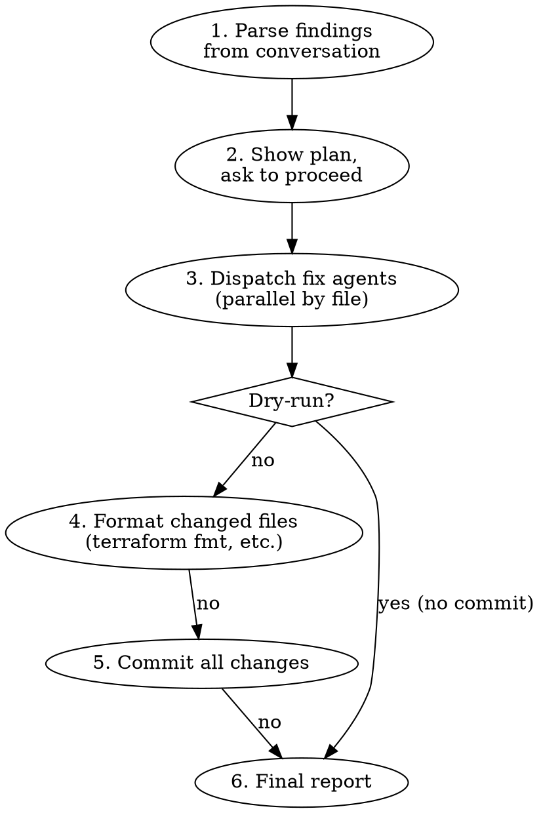

# fix

Reads code review findings already in the conversation, fixes every actionable
issue in the local working tree, and produces a single commit.

Works with output from `/review-prs`, code-reviewer agents, or any review that
follows the `- **[SEVERITY]** Category: Description` pattern. No GitHub
interaction required — all changes happen locally.

## Invocation

```text
/fix                    # Fix FAIL + WARN findings (default)
/fix fails-only         # Fix only FAIL findings, skip WARNs
/fix dry-run            # Plan fixes and show diffs without committing
/fix fails-only dry-run # Combine both switches
```

### Argument Parsing

Tokenize arguments (case-insensitive):

- `fails-only`, `fail-only`, `fails_only` → set `{FAILS_ONLY}` to `true`
- `dry-run`, `dryrun`, `dry_run` → set `{DRY_RUN}` to `true`
- All other tokens are ignored (graceful)

Derived display variables:

- `{MODE}` = `"DRY-RUN"` when `{DRY_RUN}` is `true`; `"FULL"` otherwise

## Workflow



## Step 1: Parse Findings from Conversation

Scan the conversation history for code review output. Look for these patterns:

**Standard findings format** (from `/review-prs` and code-reviewer agents):

```text
- **[FAIL]** Category: Description
  - File: path/to/file.tf:42
  - Suggestion: How to fix
```

**Also recognize:**

- `**FAIL**`, `**WARN**`, `[FAIL]`, `[WARN]` severity markers
- Lines matching `File:`, `file:`, `Path:`, `path:` followed by a file path
- Inline comment objects with `"path"` and `"line"` keys (from review JSON)

For each finding, extract:

- `severity`: FAIL or WARN (skip INFO)
- `category`: e.g., "Identifier Naming"
- `description`: the issue text
- `file`: relative path (if present)
- `line`: line number (if present)
- `suggestion`: how to fix (if present)

Apply the severity filter:

- Default: include both FAIL and WARN
- `{FAILS_ONLY}` = `true`: include only FAIL

**If no actionable findings are found**, report:

```text
No FAIL/WARN findings with file references found in the conversation.
Run a code review first (e.g., /review-prs <number> sanity), then /fix.
```

And stop.

**If findings have no file references**, they cannot be fixed automatically
(e.g., branch naming, PR title). Note these in the report as "not auto-fixable"
and skip them.

## Step 2: Show Plan and Confirm

Group findings by file and present a plan table:

```text
Found {N} fixable findings ({F} FAIL, {W} WARN):

| # | Severity | File | Line | Category | Fix |
|---|----------|------|------|----------|-----|
| 1 | FAIL | deployments/foo/main.tf | 42 | Identifier Naming | Rename `service_name_role` → `service_name` |
| 2 | WARN | deployments/foo/variables.tf | 15 | Variables | Add `validation` block |
| 3 | FAIL | deployments/foo/main.tf | 67 | List Formatting | Expand inline list to multi-line |

Files to modify: 2
Mode: {DRY_RUN ? "DRY-RUN (no commit)" : "FULL (will commit)"}

Proceed? (yes/no/fails-only)
```

Use `AskUserQuestion` for this. If the user selects `fails-only`, re-filter
findings and restart the plan display. If the user selects `fails-only` again,
treat it as `yes` and proceed.

**Skip this step** (proceed automatically) if the user already confirmed in
their message (e.g., "yes fix all", "fix everything", "apply all fixes").

## Step 3: Dispatch Fix Agents (Parallel)

Group findings by file. Dispatch one agent per file in a **single message**
for parallel execution. Use `model: "sonnet"`.

Each agent receives:

- The file path and its current contents (read by you before dispatching)
- The list of findings for that file with line numbers and suggestions
- Whether this is a dry-run
- The file type (for format instructions)

### Agent Prompt Template

````text
You are fixing code review issues in a single file.

**Mode: {MODE}** (FULL or DRY-RUN)

## File

Path: {FILE_PATH}

Current contents:
```
{FILE_CONTENTS}
```

## Issues to Fix

{FINDINGS_LIST}

## Instructions

For each issue listed:

1. Read the surrounding context (at minimum 20 lines above and below the reported line)
2. Understand what the reviewer found and what the suggestion says
3. Apply the minimal change that fixes the issue:
   - **Identifier renaming**: Update ALL references to the renamed identifier
     within this file (other files are handled by other agents)
   - **List formatting**: Expand single-line lists to multi-line with trailing commas, sorted alphabetically
   - **Variable/output attributes**: Add the missing `description`, `type`, or `validation`
   - **Ordering**: Sort parameters alphabetically within the block
   - **Security**: Apply the specific remediation in the suggestion
4. If a suggestion is ambiguous or would require understanding files not shown here,
   apply the most conservative interpretation and note it in your output

**Do NOT**:
- Make changes beyond what the issues list
- Refactor or "clean up" unrelated code
- Change formatting in lines not related to the fixes

**In DRY-RUN mode**: Describe the changes you would make but do NOT use Edit or Write tools.
Output the planned changes as unified diffs in your report.

**In FULL mode**: Use the Edit tool to apply each fix. Be surgical — change only what's needed.

## Output Format

After applying fixes:

```
FIXED: {file_path}
Changes made:
- Line {N}: {brief description of change}
- Line {N}: {brief description of change}

Cross-file references to update:
- {other_file.tf}: references `{old_name}` that may need updating
(leave empty if no cross-file impact)
```
````

### Cross-File Reference Handling

After all agents complete, collect their "cross-file references to update"
outputs. If any agent flagged cross-file references (e.g., a renamed identifier
used in another file), dispatch additional targeted agents to update those
references, OR handle them inline if there are only 1-2 occurrences (use the
Grep tool first to find all occurrences).

## Step 4: Format Changed Files

**Skip in DRY-RUN mode.**

After all fix agents complete, run appropriate formatters on modified files:

**Terraform files (`.tf`):**

```bash
terraform fmt {FILE_PATH}
```

Run once per changed `.tf` file. If `terraform fmt` is not available, skip silently.

**Other file types**: Skip formatting (rely on the fix agent to match existing style).

## Step 5: Commit (Full Mode Only)

**Skip in DRY-RUN mode.**

After all fixes and formatting are applied:

1. Stage only the files that were modified:

   ```bash
   git add {file1} {file2} ...
   ```

2. Commit with a structured message listing each fix:

   ```bash
   git commit -m "$(cat <<'EOF'
   fix: address code review findings

   {bullet list of fixes, one per finding, e.g.}
   - deployments/foo/main.tf:42 rename `service_name_role` → `service_name`
   - deployments/foo/variables.tf:15 add validation block to timeout variable
   - deployments/foo/main.tf:67 expand inline list to multi-line
   EOF
   )"
   ```

If there are no staged changes (all agents had nothing to fix), report:

```text
No files were modified. The findings may have already been fixed, or they
had no auto-fixable file changes.
```

## Step 6: Final Report

### Full Mode

```text
## Fix Results

| # | File | Line | Category | Status |
|---|------|------|----------|--------|
| 1 | deployments/foo/main.tf | 42 | Identifier Naming | Fixed |
| 2 | deployments/foo/variables.tf | 15 | Variables | Fixed |
| 3 | deployments/foo/main.tf | 67 | List Formatting | Fixed |

Files modified: 2
Commit: {COMMIT_SHA}

### Not Auto-Fixed (require manual action)

| Finding | Reason |
|---------|--------|
| Branch Naming | Not a file-level change |
| PR Title Format | Not a file-level change |
```

### Dry-Run Mode

```text
## Fix Plan (DRY-RUN — no changes applied)

| # | File | Line | Category | Planned Change |
|---|------|------|----------|----------------|
| 1 | deployments/foo/main.tf | 42 | Identifier Naming | Rename `service_name_role` → `service_name` on line 42 |
| 2 | deployments/foo/variables.tf | 15 | Variables | Add `validation { condition = ... }` block after type |
| 3 | deployments/foo/main.tf | 67 | List Formatting | Expand `["a", "b", "c"]` to multi-line with trailing commas |

To apply these changes: `/fix`
```

## Notes

- This skill fixes findings already in the conversation — run a review first
  (e.g., `/review-prs <number> sanity`, or ask Claude to review the code)
- For GitHub PR review thread comments, use `/address-pr-comments` instead
- Agents are dispatched per-file in parallel for speed
- Cross-file renames (identifiers used in multiple files) are handled via a
  second pass after the initial fix agents complete
- `terraform fmt` is run automatically on all modified `.tf` files
