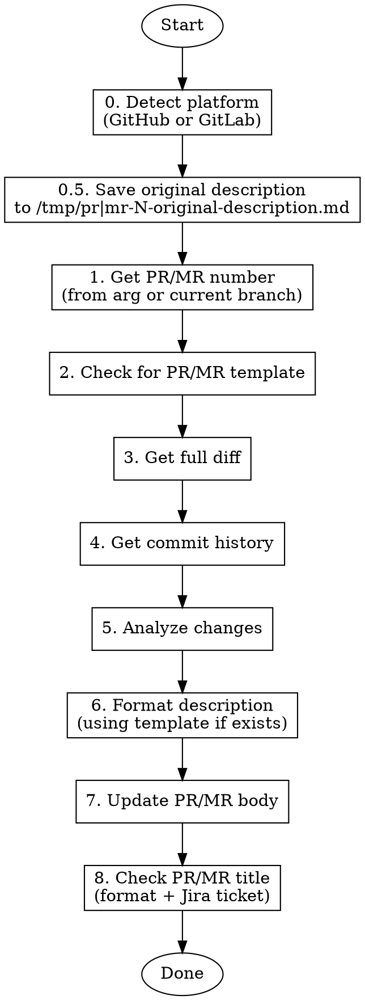

# PR/MR Description Update

Analyze all changes in a pull request (GitHub) or merge request (GitLab) and update the description/body with a comprehensive summary.

## Quick Reference

| Command | Description |
| --- | --- |
| `/pr-comment-update` | Analyze current branch PR/MR and update its description |
| `/pr-comment-update 123` | Analyze PR/MR #123 and update its description |
| `/pr-comment-update owner/repo#123` | Analyze PR/MR in specific repo (GitHub) |
| `/pr-comment-update group/project#123` | Analyze MR in specific project (GitLab) |

## Step 0: Detect Platform

Determine whether the repo uses GitHub or GitLab:

```bash
git remote get-url origin
# github.com → use gh commands
# gitlab.com or self-hosted GitLab → use glab commands
```

## Workflow



## Step 0.5: Save Original Description

Before making any changes, save the current PR/MR description to `/tmp/` so the user can restore it or reference the original later.

**GitHub:**

```bash
PR_NUMBER=$(gh pr view --json number --jq '.number')
gh pr view "$PR_NUMBER" --json body --jq '.body' > /tmp/pr-${PR_NUMBER}-original-description.md
echo "Saved original description to /tmp/pr-${PR_NUMBER}-original-description.md"
```

**GitLab:**

```bash
MR_NUMBER=$(glab mr view --output json | jq '.iid')
glab mr view "$MR_NUMBER" --output json | jq -r '.description' > /tmp/mr-${MR_NUMBER}-original-description.md
echo "Saved original description to /tmp/mr-${MR_NUMBER}-original-description.md"
```

Tell the user the backup path so they know where to find it if they want to restore or cherry-pick from the original.

## Step 1: Get PR/MR Number

**GitHub:**

```bash
# If no PR number provided, get from current branch
gh pr view --json number --jq '.number'

# For cross-repo: gh pr view 123 -R owner/repo
```

**GitLab:**

```bash
# If no MR number provided, get from current branch
glab mr view --output json | jq '.iid'

# For cross-project: glab mr view 123 -R group/project
```

## Step 2: Check for Template

**GitHub:**

```bash
cat .github/pull_request_template.md 2>/dev/null || echo "No template"
```

**GitLab:**

```bash
ls .gitlab/merge_request_templates/ 2>/dev/null || echo "No templates"
cat .gitlab/merge_request_templates/Default.md 2>/dev/null || echo "No default template"
```

## Step 3: Get Full Diff

**GitHub:**

```bash
gh pr diff <PR_NUMBER>

# For large PRs, get file list first
gh pr view <PR_NUMBER> --json files --jq '.files[].path'
```

**GitLab:**

```bash
glab mr diff <MR_NUMBER>

# For large MRs, get file list first
glab api projects/:id/merge_requests/<MR_NUMBER>/changes --jq '.changes[].new_path'
```

## Step 4: Get Commit History

**GitHub:**

```bash
gh pr view <PR_NUMBER> --json commits --jq '.commits[] | "\(.oid[0:7]) \(.messageHeadline)"'
```

**GitLab:**

```bash
glab api projects/:id/merge_requests/<MR_NUMBER>/commits --jq '.[] | "\(.short_id) \(.title)"'
```

## Step 5: Analyze Changes

Review the diff and identify:

- **Purpose**: What does this PR/MR accomplish?
- **Key changes**: Major code modifications
- **Files affected**: Which areas of codebase
- **Breaking changes**: Any API or behavior changes
- **Dependencies**: New packages or version changes
- **Tests**: Test additions or modifications

## Step 6: Format Description

Structure based on template if available, otherwise use:

```markdown
## Summary
[1-3 bullet points describing what this PR/MR does]

## Changes
- [List key changes by category]

## Testing
[How the changes were tested]

## Notes
[Any additional context for reviewers]
```

**If Jira ticket found in branch name or commits:**

- Extract ticket key (e.g., `PROJ-123`)
- Add link at top: `[PROJ-123](https://axonius.atlassian.net/browse/PROJ-123)`

## Step 7: Update Description

**GitHub:**

```bash
gh pr edit <PR_NUMBER> --body "$(cat <<'EOF'
<generated description here>
EOF
)"
```

**GitLab:**

```bash
glab mr update <MR_NUMBER> --description "$(cat <<'EOF'
<generated description here>
EOF
)"
```

## Example Output

```markdown
[AUTH-456](https://axonius.atlassian.net/browse/AUTH-456)

## Summary
- Add JWT-based authentication middleware
- Implement login/logout endpoints
- Add session management with Redis

## Changes

### New Features
- `POST /api/auth/login` - User login with email/password
- `POST /api/auth/logout` - Session invalidation
- `GET /api/auth/me` - Get current user info

### Security
- Password hashing with bcrypt (cost factor 12)
- JWT tokens with 24h expiration
- Rate limiting on auth endpoints

### Dependencies
- Added `jsonwebtoken@9.0.0`
- Added `bcrypt@5.1.0`

## Testing
- Unit tests for auth middleware
- Integration tests for login flow
- Manual testing with Postman

## Notes
- Requires `JWT_SECRET` environment variable
- Redis must be running for session storage
```

## Step 8: Check PR/MR Title

After updating the description, always check whether the PR/MR title is correct. A bad title is easy to miss and looks unprofessional to reviewers.

**Get the current title:**

GitHub:

```bash
gh pr view <PR_NUMBER> --json title --jq '.title'
```

GitLab:

```bash
glab mr view <MR_NUMBER> --output json | jq -r '.title'
```

**Expected format:** `TICKET-ID - Description`

Example: `INF-456 - Add S3 bucket module for data lake`

**Check for these issues:**

| Issue | Example of bad title | Fix |
| --- | --- | --- |
| Missing ticket ID | `Add S3 bucket module` | Prepend ticket ID: `INF-456 - Add S3 bucket module` |
| Wrong separator | `INF-456: Add S3 bucket` | Use ` - ` (space-dash-space) |
| Ticket ID doesn't match branch | Branch is `task.INF-456.foo`, title has `INF-789` | Correct the ticket ID |
| Ticket ID at end or middle | `Add S3 bucket INF-456` | Move ticket ID to front |
| No description after ticket ID | `INF-456` | Add a meaningful description |
| Title is a commit message | `fix typo` | Replace with a proper summary |

**Determine the correct ticket ID** by checking (in order):

1. Branch name pattern `[type].[TICKET-ID].[description]`
2. Commit messages in the PR/MR
3. The current title itself (if it already contains one)

**If the title is correct:** tell the user "Title looks good: `<title>`" and finish.

**If the title needs fixing:** propose the corrected title and ask the user to confirm before updating. Once confirmed, apply it:

GitHub:

```bash
gh pr edit <PR_NUMBER> --title "TICKET-ID - Description"
```

GitLab:

```bash
glab mr update <MR_NUMBER> --title "TICKET-ID - Description"
```

## Common Issues

| Issue | Solution |
| --- | --- |
| No PR for current branch (GitHub) | Run `gh pr create` first or specify PR number |
| No MR for current branch (GitLab) | Run `glab mr create` first or specify MR number |
| Permission denied | Ensure you have write access to the repository/project |
| Template not found | Use default format; check `.github/` (GitHub) or `.gitlab/merge_request_templates/` (GitLab) |
| Large diff timeout | Get file list first, then read key files individually |
| GitLab self-hosted | Set `GITLAB_HOST` env var or use `--hostname` flag with `glab` |
